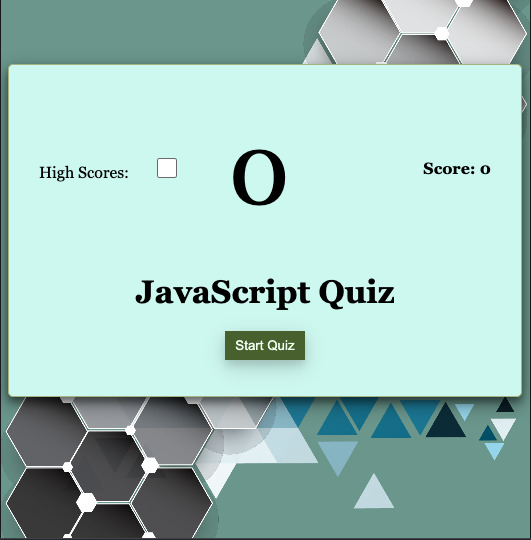

# QuizWiz Reloaded

Welcome to QuizWiz Reloaded! This is a simple web application that lets you practice answering JavaScript-related quiz questions. Test your knowledge and challenge yourself to improve your coding skills!

## Features

- Start the quiz: Click the "Start Quiz" button to begin the quiz.
- Answer questions: For each question, choose the correct answer from the provided options.
- Timer: You have a total of 60 seconds to complete the quiz. The timer starts as soon as you click the "Start Quiz" button.
- Score Tracking: Your correct answers will be tallied up, and you'll receive 100 points for each correct answer.
- High Scores: Toggle the "High Scores" switch to see a list of high scores achieved by other participants.
- Restart: If you want to try the quiz again, click the "Restart" button to reset your progress.

## How to Use

1. Open the `index.html` file in your web browser.
2. Click the "Start Quiz" button to begin the quiz.
3. Read each question carefully and click on the option you believe is correct.
4. The timer will count down from 60 seconds. Try to answer as many questions as you can before time runs out.
5. Your score will be displayed on the top-right corner of the page. Each correct answer adds 100 points to your score.
6. If you finish the quiz before the timer runs out, you can see the high scores by toggling the "High Scores" switch.
7. When the quiz is complete, you'll be prompted to enter your name. Submit your score to see your name and score on the high scores list.

## Technologies Used

- HTML: The structure of the web page.
- CSS: Styling for the layout and visual elements.
- JavaScript: Logic and functionality of the quiz.

## Notes

- The quiz contains a variety of JavaScript-related questions to help you practice your coding skills.
- The timer adds an element of challenge to the quiz. Try to answer questions quickly and accurately!
- Your high score will be saved locally, allowing you to track your progress over time.
- Feel free to modify the code or add more questions to enhance your learning experience.

Enjoy QuizWiz Reloaded and have fun improving your JavaScript knowledge!

## Attribution for Royalty-Free Assets

### Sounds

- "Ding Sound" by [Pixabay](https://pixabay.com/sound-effects/search/ding/) (License: Personal Use)
- "Incorrect Sound" by [Pixabay](https://pixabay.com/sound-effects/search/wrong/) (License: Personal Use)
- "Applause Sound" by [Pixabay](https://pixabay.com/sound-effects/search/applause/) (License: Personal Use)

### Images

- "Background Image" by [CleanPNG](https://www.cleanpng.com/png-colorful-diamond-background-vector-5467/download-png.html) (License: Personal Use)

Please make sure to visit the provided links to learn more about the licensing terms and to give proper credit to the creators of these assets.

Github: https://github.com/brlumar/quizWiz_reloaded
Site URL: https://brlumar.github.io/quizWiz_reloaded/

